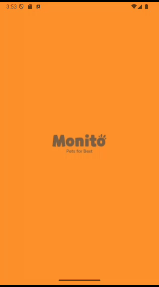

# PetAppKMP
> A Kotlin Multiplatform Project - Android and Desktop

## Preview Video

## Features
- Fetch pets from [PetFinder API](https://www.petfinder.com/developers/v2/docs/#get-animals)
- Display display all pets with infinity scroll in desktop and android
- Load pets images using Coil
- Clean MVVM architecture
- Dependency injection with Koin
- Shared some code and screen between Android and Desktop using KMM to show how versatile is KMP
- Also share resources between platforms
- Create separated ui code and instances for both platform (Android and Desktop) when shared code is not useful

## Tech Stack
- **Kotlin Multiplatform (KMP)**: Share business logic between Android and Desktop
- **Ktor**: HTTP client for API communication
- **Coil**: Image loading for Android
- **Koin**: Dependency injection
- **MVVM Architecture**: Clean and scalable code structure

## Why KMP ?
> Because with kmp you can share all of the core with multiple projects and interfaces easily. If you have a POS app, you can use the same core create your sales point in a customer selfcheckout, android and desktop with any interface.

## Screen shots

### Desktop

 
### Mobile

 

## Project Arch
1. **common**: All the shared code between platforms - Domain, Data, DI, Resources and SharedPresentation
2. **androidApp**: All android interfaces, composables and di
3. **desktopApp**: All desktop interfaces, composables and di

<code> FOLDERS
  ├── androidApp/**
  ├── desktopApp/**
  ├── common/**
  └── build.gradle  
</code>

- This project was created using Petfinder Api - [PetFinder API](https://www.petfinder.com/developers/v2/docs/#get-animals)
- Figma template - [FIGMA TEMPLATE](https://www.figma.com/community/file/1164046882633361201/free-template-ecommerce-website-monito-pets-for-best-community)

**Developed by Jonathan Souza**

